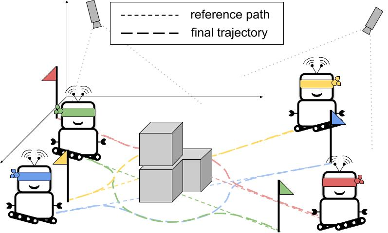

# DDPG-Boosted MPC for Collision-Free Navigation of Multiple Mobile Robots
*Trajectory Planning of Multiple Robots using Vision-Based Continuous Deep Reinforcement Learning and Model Predictive Control*



The main branch of this repository is the single robot implementation of our paper. The multiple robot implementation is in a separate branch in the repository.

## Quick Start
### OpEn
The NMPC formulation is solved using open source implementation of PANOC, namely [OpEn](https://alphaville.github.io/optimization-engine/). Follow the [installation instructions](https://alphaville.github.io/optimization-engine/docs/installation) before proceeding. 

### Install dependencies (after installing OpEn)
```
pip install -r requirements.txt
```
or
```
conda env create -f environment.yaml
```
**NOTE** If you cannot create the virtual environment via conda, please create your own virtual environment (e.g. conda create -n rlboost python=3.9), and pip install.
Make sure your RUST is up-to-date and Pytorch is compatible with Cuda. 

### Generate MPC solver
Go to "test_block_mpc.py", change **INIT_BUILD** to true and run
```
python test_block_mpc.py
```
After this, a new directory *mpc_build* will appear and contain the solver. Then, you are good to go :)

### To train the DDPG
Go to "src/continous_training_local.py", change **load_checkpoint** to False and run.

## Use Case
Run *src/main_continous.py* for the simulation in Python. Several cases are available by changing ```scene_option``` in *src/main_continous.py*.

## Evaluation videos
Videos of the evaluations are available on [youtube](https://www.youtube.com/watch?v=A2TAuWXqH2k&list=PLPOBQOuy0QPRkYZ1olWVMvoB_gpyaQp5T)


## 


